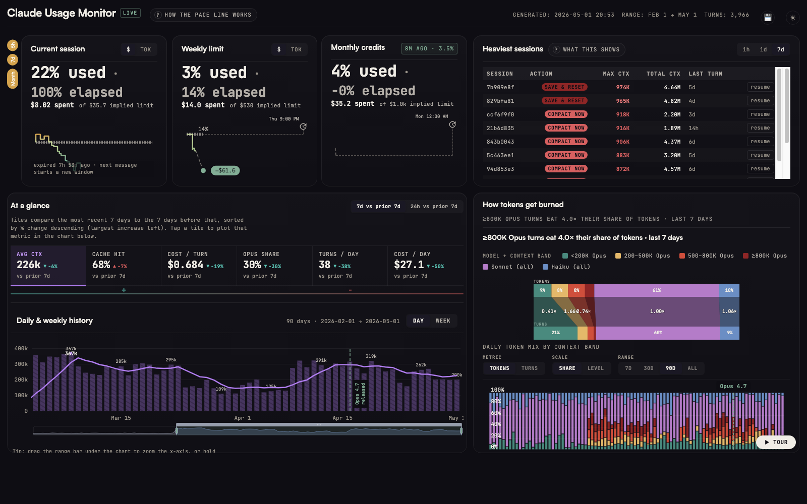
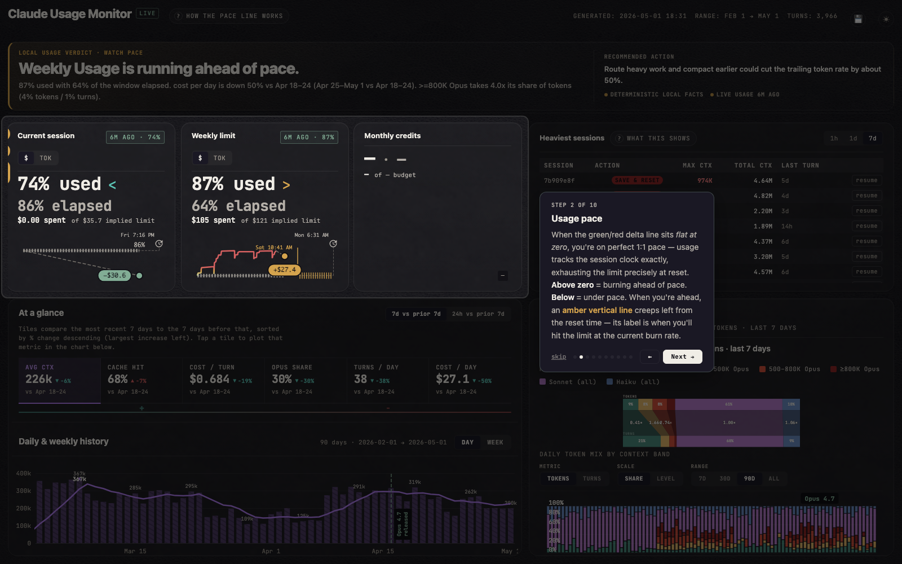
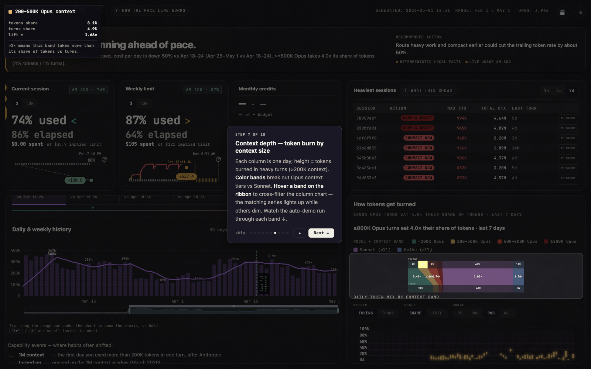

# Claude Usage Dashboard

A self-contained Claude usage dashboard for Claude Code Max users — tracks pacing, heavy sessions, context depth, and historical trends. One HTML file, runs offline, no backend required.

**[Live preview →](https://keithbinkly.github.io/claude-usage-dashboard/dashboard-sample.html)**



---

## What it shows

Click `?` in the dashboard header to launch a 10-step interactive tour explaining every section. Quick summary:

1. **Interactive tour** — guided walk-through of the whole dashboard
2. **Usage pace** — green/red delta line vs steady pace to your reset; amber projection line shows when you'll hit the limit
3. **Heaviest sessions** — sessions with 500K+ context, sorted by token cost; where your budget actually went
4. **KPI strip** — cost, turns, avg context, cache hit rate, Opus share vs prior period; tiles sort by largest % increase left
5. **7d vs 24h toggle** — compare last 7 days vs prior 7 days, or last 24h vs the 7-day baseline
6. **Historical trends** — zoomable daily/weekly chart; drag range slider, toggle Day/Week aggregation
7. **Context depth** — token burn by context-size tier (ribbon + column chart); hover a band to cross-filter
8. **Trend toggles** — metric (tokens/turns), scale (share/level), range (7d/30d/90d/all)
9. **Download** — CSV export of aggregated daily stats
10. **Light / dark** — theme toggle, saved in localStorage

---

## Tour walk-through

**Step 2 — Usage pace** (cycleKpiTiles demo auto-runs on step 4):



**Step 7 — Context depth** (cycleRibbon demo auto-runs, cross-filters the column chart):



---

## Add your own data

**Prefer a guided install?** See [`INSTALL.md`](INSTALL.md) for a prompt you can paste into a Claude Code session and have it walk through the whole setup for you.

**Prerequisites:** macOS + Claude Code installed and logged in. The script reads `~/.claude/projects/*.jsonl` session logs — nothing else needed.

```bash
git clone https://github.com/keithbinkly/claude-usage-dashboard
cd claude-usage-dashboard

# Generate wide dashboard and open it
python3 claude_usage.py --layout wide --out my-dashboard.html
open my-dashboard.html

# Shorter lookback (default is all-time)
python3 claude_usage.py --layout wide --days 30 --out my-dashboard.html
```

The generated HTML is fully self-contained — open it in any browser, share it, archive it. Re-run to refresh.

### Optional: live pacing endpoint

For pacing gauges that refresh without regenerating the whole file:

```bash
python3 serve.py
# → http://localhost:8922
```

The server calls Anthropic's OAuth endpoint (`api.anthropic.com`) using your existing Claude Code token from the macOS Keychain. No extra setup.

### Optional: scheduled regeneration (macOS launchd)

Create `~/Library/LaunchAgents/com.claude-usage.plist`:

```xml
<?xml version="1.0" encoding="UTF-8"?>
<!DOCTYPE plist PUBLIC "-//Apple//DTD PLIST 1.0//EN"
  "http://www.apple.com/DTDs/PropertyList-1.0.dtd">
<plist version="1.0">
<dict>
    <key>Label</key><string>com.claude-usage</string>
    <key>ProgramArguments</key>
    <array>
        <string>/usr/bin/python3</string>
        <string>/Users/YOU/claude-usage-dashboard/claude_usage.py</string>
        <string>--layout</string><string>wide</string>
        <string>--out</string>
        <string>/Users/YOU/claude-usage-dashboard/my-dashboard.html</string>
    </array>
    <key>StartInterval</key><integer>1800</integer>
    <key>RunAtLoad</key><true/>
</dict>
</plist>
```

```bash
launchctl load ~/Library/LaunchAgents/com.claude-usage.plist
```

---

## Privacy

The dashboard runs 100% locally. No data leaves your machine. The only network call is the optional rate-limit fetch (`/api/rate-limits` via `serve.py`), which goes directly to `api.anthropic.com` using your existing Claude Code OAuth token from the macOS Keychain — the same token the Claude Code CLI already uses.

---

## Layout variants

| Flag | Description |
|------|-------------|
| `--layout wide` | Full two-column layout: pacing + sessions side-by-side, KPI strip, trends, context ribbon |
| _(default)_ | Narrower single-column editorial layout |

---

## Customizing

- **Lookback:** `--days N` (default: all-time)
- **Output file:** `--out filename.html`
- **Sample data:** `--sample` generates synthetic data (used for the live preview above)
- **Port conflict:** `python3 serve.py --port 9000`

---

## Troubleshooting

**"No projects found"** — Claude Code hasn't run on this machine, or `~/.claude/projects/` is empty.

**Dashboard shows 0 turns** — Check `--days`. If you started recently, try `--days 7`.

**Pacing gauges show "—"** — OAuth fetch failed. Most common: Claude Code not logged in, or not on macOS. Run `serve.py` and check the browser console.

---

## Feedback & contributing

Bug reports, ideas, and PRs all welcome.

- **Issues + PRs:** [github.com/keithbinkly/claude-usage-dashboard/issues](https://github.com/keithbinkly/claude-usage-dashboard/issues)
- **LinkedIn:** [linkedin.com/in/keithbinkly](https://www.linkedin.com/in/keithbinkly)

If you ship something cool on top of this — a different layout, a new metric, an export to your own warehouse — I'd love to see it.

---

## License

MIT
